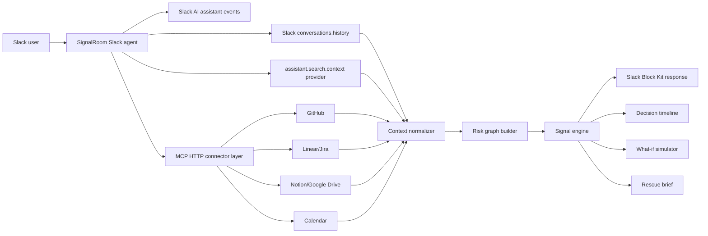

# SignalRoom

**SignalRoom is the Slack agent that detects hidden project risks before they become delays.**

Most Slack agents tell teams what happened. SignalRoom tells them what is likely to break next.

It searches live team context, maps blockers and decisions, finds contradictions, and generates an evidence-backed rescue plan inside Slack.

## Demo


Ask:

```text
/signalroom launch
```

SignalRoom replies with a launch risk score, hidden blockers, missing owners, contradictions, overloaded people, citations, and recommended next actions.

Then ask:

```text
/signalroom whatif payment slips 2 days
/signalroom timeline
/signalroom brief
```

## Built for Slack

- **New Slack Agent:** users interact with SignalRoom in Slack through slash commands and app mentions.
- **Slack AI agent surface:** SignalRoom is designed for Slack's agent surfaces with slash commands, app mentions, assistant thread events, suggested prompts, and evidence-backed Slack-native responses.
- **MCP integration:** optional MCP HTTP servers can enrich the risk graph with GitHub, Linear/Jira, Notion, Google Drive, and Calendar evidence through `signalroom.project_context`.
- **Real-Time Search API support:** SignalRoom includes a Slack `assistant.search.context` provider. When Slack provides an assistant action token, it uses that search context; otherwise it clearly falls back to channel history.
- **Slack-Native UX:** output uses Block Kit risk cards, cited evidence, and one-click action buttons.

## Architecture



SignalRoom collects Slack conversation history, optional Slack AI search context, and optional MCP tool evidence, then normalizes everything into a risk graph before posting cited Slack-native rescue plans.

## Local Demo

This runs without Slack credentials and produces the exact analysis used in the demo video:

```bash
npm run demo
```

Run verification:

```bash
npm test
```

## Slack Setup

1. Create a Slack app.
2. Add the bot scopes from `slack-app-manifest.json`.
3. Create the slash command `/signalroom`.
4. Enable Socket Mode or expose the app with a public HTTPS URL.
5. In Slack app settings, enable Agents & AI Apps if it is available in your workspace.
6. Copy `.env.example` to `.env` and fill in Slack credentials.
7. Install dependencies and start:

```bash
npm install
npm start
```

## Judge / Production Test Setup

For judging, run SignalRoom in a workspace the judges can access, not only on a local laptop.

1. Create or use a production Slack workspace.
2. Install SignalRoom with the scopes in `slack-app-manifest.json`.
3. Invite `slackhack@salesforce.com` and `testing@devpost.com` to the workspace and the demo channel.
4. Deploy the Node app on a stable host such as Render, Railway, Fly.io, a VPS, or any always-on Node 20 service.
5. Set these environment variables on the host:

```bash
SLACK_BOT_TOKEN=xoxb-...
SLACK_SIGNING_SECRET=...
SLACK_APP_TOKEN=xapp-...
PORT=3000
SIGNALROOM_AI_ENABLED=true
SIGNALROOM_RTS_ENABLED=true
SIGNALROOM_MCP_ENABLED=true
MCP_SERVER_URLS=https://your-mcp-server.example/mcp
SIGNALROOM_DEBUG=false
```

6. Keep Socket Mode enabled if your host does not expose a public Slack request URL.
7. In Slack, create a channel such as `#signalroom-judging`, invite SignalRoom, post project-risk messages, then run `/signalroom launch`.

If the app is run locally for a live demo, keep the terminal open for both the Slack app and the demo MCP server.

## Slack AI, MCP, and Search Setup

SignalRoom uses Slack as the agent surface and context source:

1. `/signalroom launch` is the Slack agent entrypoint.
2. `conversations.history` reads recent channel messages.
3. Slack AI agent events can provide assistant thread context and action tokens.
4. `assistant.search.context` can retrieve relevant Slack messages/files/channels for an agent request.
5. SignalRoom classifies blockers, missing ownership, overload, decision conflicts, and dependency risk.
6. MCP servers optionally add external context before the analysis.
7. SignalRoom posts the risk radar back into Slack with citations.

To enable MCP enrichment, run one or more MCP HTTP servers and set:

```bash
MCP_SERVER_URLS=https://your-mcp-server.example/mcp
MCP_SERVER_TOKENS=optional-token
```

Each MCP server should expose a `signalroom.project_context` tool that accepts `{ project, channel, recentMessages }` and returns:

```json
{
  "messages": [{ "source": "GitHub MCP", "text": "Deployment waits on infra approval.", "url": "https://..." }],
  "issues": [],
  "docs": [],
  "calendar": []
}
```

For the hackathon demo, Slack channel history is enough to show the working agent. MCP enrichment is implemented and covered by tests.

### Real-Time Search Status

SignalRoom is honest about Real-Time Search:

- If `assistant.search.context` is available for the request, debug logs show `RTS search used`.
- If it is not available, debug logs show `RTS search fallback used` and SignalRoom analyzes `conversations.history` instead.
- Do not claim Real-Time Search is active in a demo unless logs show `RTS search used`.

## Proving The Integrations

### Test Slack AI / Real-Time Search path

1. Make sure these flags are set:

```bash
SIGNALROOM_AI_ENABLED=true
SIGNALROOM_RTS_ENABLED=true
SIGNALROOM_MCP_ENABLED=false
SIGNALROOM_DEBUG=true
```

2. Restart SignalRoom and use `/signalroom launch` in a project channel.

For slash commands, SignalRoom always works from Slack channel history. When the Slack AI assistant surface provides an action token, SignalRoom also calls `assistant.search.context`; otherwise it logs that Real-Time Search fell back to channel history.

### Test optional MCP path locally

Open terminal 1:

```bash
cd ~/signalroom
npm run mcp:demo
```

Open terminal 2:

```bash
cd ~/signalroom
SIGNALROOM_MCP_ENABLED=true \
SIGNALROOM_DEBUG=true \
MCP_SERVER_URLS=http://127.0.0.1:8787 \
npm start
```

Then create a fresh Slack channel, for example `#signalroom-ai-mcp-test`, invite SignalRoom, and post:

```text
Decision: release date is locked for Thursday unless API or deployment changes.
Frontend waits on API contract before checkout screens can finish.
Staging deploy is unstable and rollback proof is not ready.
Security review needs final approval and no owner is assigned.
I am handling API contract, checkout screens, release notes, and smoke tests. Too much on my plate.
```

Run:

```text
/signalroom launch
```

You should see risks from the channel plus MCP evidence from `GitHub MCP` and `Linear MCP`.

## Core Commands

- `/signalroom launch` - launch readiness and risk radar.
- `/signalroom whatif <scenario>` - simulate a delay, unavailable owner, or missing approval.
- `/signalroom timeline` - decision timeline with citations.
- `/signalroom brief` - executive-ready launch rescue brief.
- `/signalroom clean` - remove recent SignalRoom bot messages from the current channel for demo reset.

## Product Thesis

Team risk is usually visible only in fragments: a missed thread, a stale issue, a calendar conflict, a doc comment, a promise from yesterday. SignalRoom turns those fragments into a living risk room inside Slack.

## Repository Map

- `src/engine/riskEngine.js` - predictive signal detection.
- `src/slack/` - Slack command routing and Block Kit UI.
- `src/providers/` - Real-Time Search and MCP integration boundaries.
- `src/providers/slackChannelWorkspace.js` - live Slack channel history adapter used by slash commands.
- `src/data/demoWorkspace.js` - deterministic demo workspace.
- `docs/` - architecture, demo script, Devpost narrative, and security notes.
