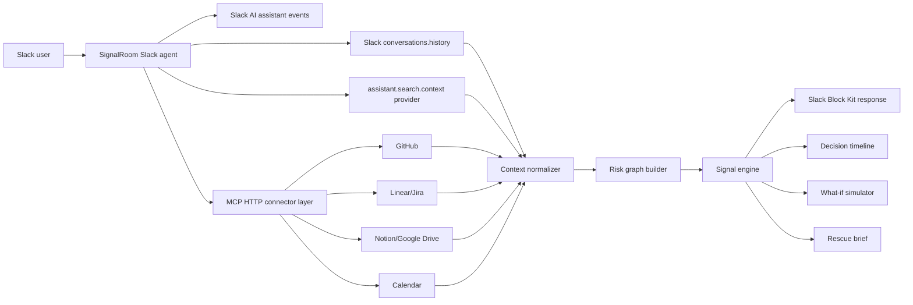

# SignalRoom Architecture

## System Flow

1. A user asks SignalRoom a launch-readiness question inside Slack.
2. The Slack agent collects fresh workspace context through Slack channel history, Slack AI assistant events, optional `assistant.search.context` retrieval when available, and MCP-backed tools.
3. The MCP connector calls `signalroom.project_context` on configured MCP HTTP servers and returns messages, tickets, docs, and calendar events.
4. The context normalizer converts Slack and MCP evidence into one model.
5. The risk graph builder links owners, deadlines, blockers, decisions, and unresolved work.
6. The signal engine detects hidden risks, contradictions, overloaded owners, stale promises, and missing approvals.
7. SignalRoom responds inside Slack with cited evidence and next actions.

## Integration Status

- Slack channel history is the reliable runtime source for slash-command demos.
- Slack AI assistant events are implemented as an agent surface.
- Real-Time Search is implemented behind the `assistant.search.context` provider and falls back to channel history when Slack does not provide search context for the request.
- MCP is optional. When `SIGNALROOM_MCP_ENABLED=true`, configured MCP HTTP servers can add GitHub, Linear/Jira, docs, and calendar evidence.

## Why This Is More Than Summarization

Summaries compress the past. SignalRoom models the future risk surface:

- unresolved blocker plus near deadline equals schedule risk
- decision conflict plus no owner equals alignment risk
- critical owner overload plus no backup equals execution risk
- stale promise plus open issue equals hidden dependency risk
